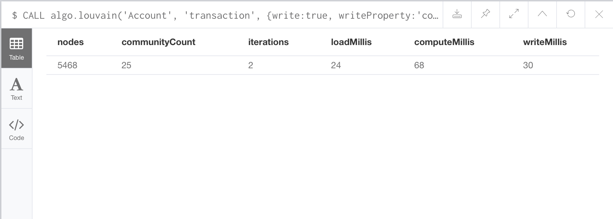
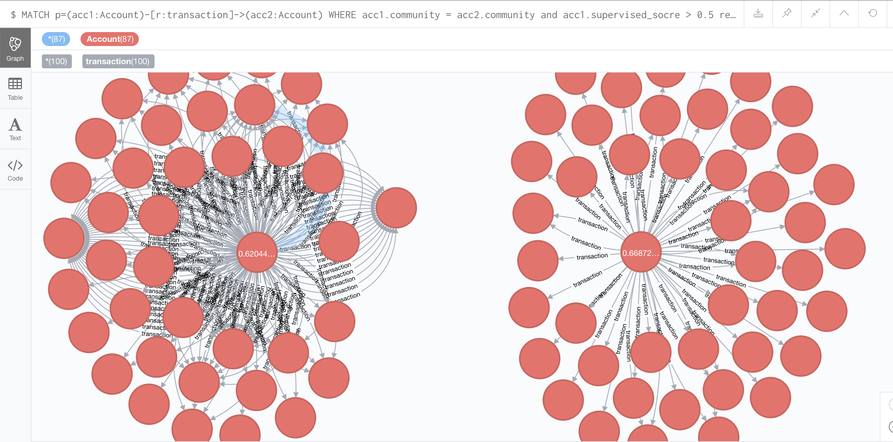
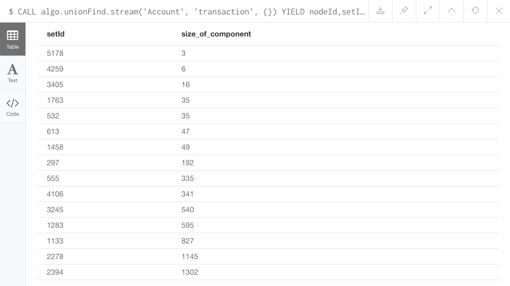
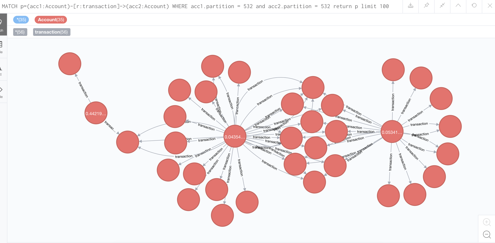
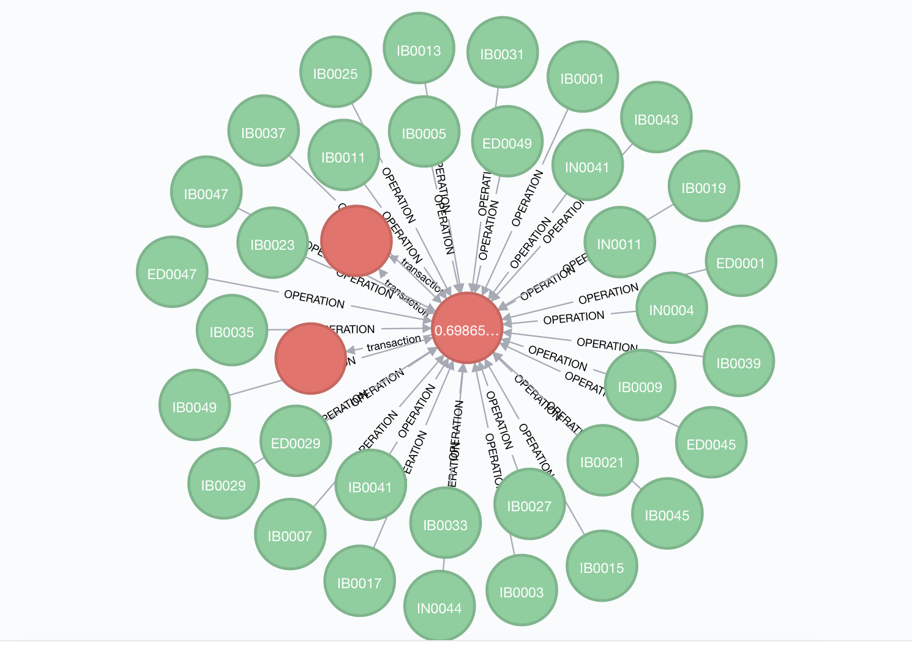
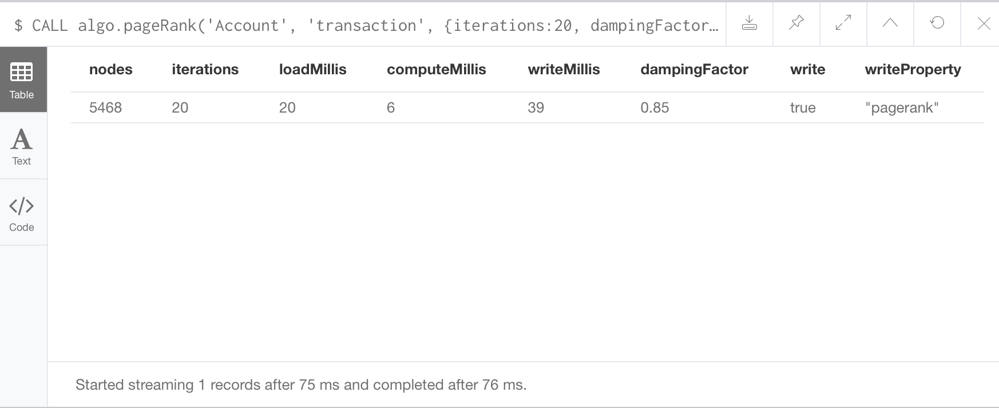
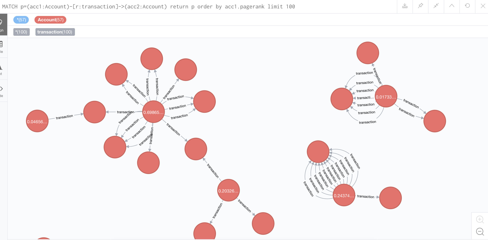
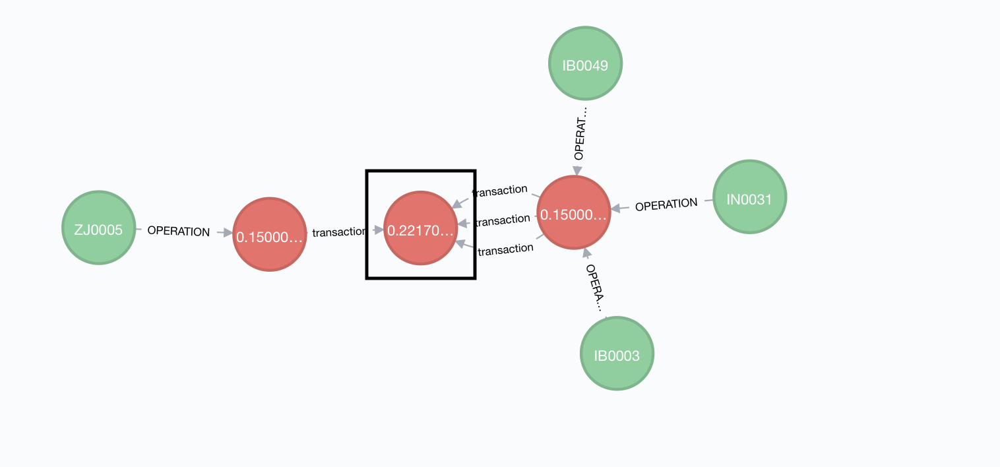
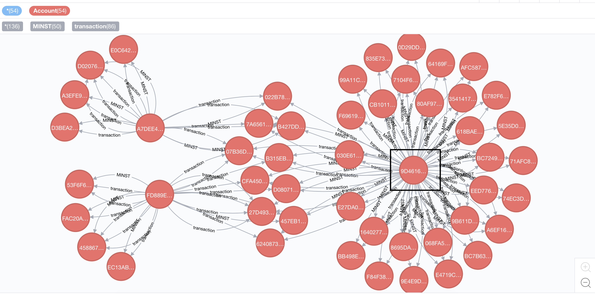

**This is to create knowledge graph and add the Machine Learning result to it, then we can explore some interesting things in knowledge greph.**

## Language and Framework
1. **Language**
    - Python==3.7.0
2. **Database**
    - neo4j==3.4.9
    

## API
> 目前添加的所有数据都来自于 csvfile, 以后根据实际需求更改

- **add_hall()**. 
    添加营业厅  
- **add_teller()**.
    添加柜员
- **add_account()**.
    添加账户
- **add_transaction_relation()**. 
    添加账户的交易关系
- **add_have_relation()**
    添加客户与账户的拥有关系
- **add_supervised_result()**.
    将监督学习的结果标注到账户的属性中
- **add_unsupervised_result()**. 
    将非监督学习的结果标注到交易关系的属性中

---

## **3类算法探索知识图谱**
1. Community detection algorithms
2. Centrality algorithms
3. Path finding algorithms


## 1. Community detection algorithms

#### Louvain algorithm

>  该算法包括两个阶段，这两个阶段重复迭代运行，直到网络社区划分的模块度不再增长。第一阶段合并社区，算法将每个节点当作一个社区，基于模块度增量最大化标准决定哪些邻居社区应该被合并。经过一轮扫描后开始第二阶段，算法将第一阶段发现的所有的社区重新看作节点，构建新的网络，在新的网络上迭代的进行第一阶段。当模块度不再增长时，得到网络的社区近似最优划分。 

算法的基本步骤如下： 
- 初始化，将每个节点划分在不同的社区中。
- 逐一选择各个节点，根据公式计算将它划分到它的邻居社区中得到的模块度增益。如果最大增益大于0，则将它划分到对应的邻居社区；否则，保持归属于原社区。
- 重复步骤2，直到节点的社区不再发生变化。
- 构建新图。新图中的点代表上一阶段产生的不同社区，边的权重为两个社区中所有节点对的边权重之和。重复步骤2，直到获得最大的模块度值。

##### 测试
1. 发现 25 个社区
    - 
2. 显示supervised_score(监督学习结果)0.6以上的账户号所在的两个社区
    - 
3. code
    ```Java
    CALL algo.louvain('Account', 'transaction', {write:true, writeProperty:'community'})
    YIELD nodes, communityCount, iterations, loadMillis, computeMillis, writeMillis;
    
    MATCH p=(acc1:Account)-[r:transaction]->(acc2:Account) WHERE acc1.community = acc2.community and acc1.supervised_socre > 0.8 return p limit 100
    
    ```
#### Connected Components 
> 连通分量：无向图G的一个极大连通子图称为G的一个连通分量（或连通分支）。连通图只有一个连通分量，即其自身；非连通的无向图有多个连通分量。 


#### 测式
1. 发现15个连通分支
    
2. 显示其中一个连通分支
    

```Java
CALL algo.unionFind('Account', 'transaction', {write:true, partitionProperty:"partition"})
YIELD nodes, setCount, loadMillis, computeMillis, writeMillis;

CALL algo.unionFind.stream('Account', 'transaction', {})
YIELD nodeId,setId
RETURN setId,count(*) as size_of_component
ORDER BY size_of_component
LIMIT 20;

MATCH p=(acc1:Account)-[r:transaction]->(acc2:Account) WHERE acc1.partition = 532 and acc2.partition = 532 return p limit 100

MATCH p=(acc1:Account)-[r:transaction]->(acc2:Account) WHERE acc1.partition = acc2.partition and acc1.supervised_socre > 0.7 return p

```

### 实际应用场景
**社区发现在异常柜员评分中的作用。以柜员所操作的客户为例，客户所形成的网络中社区是确实存在的。客户只可能与部分客户有频繁互动，不同的互动程度导致社区的形成。如果对异常客户的异常行为进行追根溯源，或者利用异常客户发现其他的异常客户，属于同一社区的客户应该优先查找，这就是“物以类聚，人以群分”的道理。对一个大型网络调用社区发现算法，其实是对其按照某种标准进行了划分，在此基础上可对每个社区做进一步的发掘。而从计算的角度而言，社区分划相当于分解了任务，起到了降低计算复杂度的作用。当我们发现了更多的异常客户，对柜员的评分也就更加客观。**

1. 异常账户维度
    - 利用监督学习的结果标注账户是否是异常
    - 然后利用账户之间的交易关系，利用知识图谱创建community
    - 如果某个community中异常账户的密度大，我们可以定义该 community 为 abnormal community.
    - abnormal community中的其他客户也可以因此定义为异常账户(至少有很大的嫌疑)，这些异常账户可能通过传统的反洗钱手段无法检测出来。
    - 最后利用这些新发现的异常客户，更新我们对柜员的评分。
    
    

    **如上图，监督学习实际找出的异常账户只有最中心的红色结点，由于它所在的 community 是一个  abnormal community， 因此我们可以推断出图中其他两个红色结点也为异常账户，最后我们再利用异常账户给图中的柜员打分(绿色结点)**

    
2. 异常交易维度
    - 利用非监督学习的结果标注交易是否是异常
    - 把交易当做实体，定义交易之间的关系，如 same_operator(相同的操作柜员). 
    - 利用交易之间的关系，构建community
    - 如果某个community中异常交易的密度大，我们可以定义该 community 为 abnormal community.
    - abnormal community中的其他交易也可以因此定义为异常交易(至少有很大的嫌疑)，这些异常交易可能通过传统的反洗钱手段无法检测出来。
    - 最后利用这些新发现的异常交易，更新我们对柜员的评分。
  
---

## 2. Centrality algorithms
#### pagerank
> PageRank is named after Google co-founder Larry Page, and is used to rank websites in Google’s search results. It counts the number, and quality, of links to a page which determines an estimation of how important the page is. The underlying assumption is that pages of importance are more likely to receive a higher volume of links from other pages.
PageRank is defined in the original Google paper as follows:
**PR(A) = (1-d) + d (PR(T1)/C(T1) + ... + PR(Tn)/C(Tn))**
where, we assume that a page A has pages T1 to Tn which point to it (i.e., are citations).
d is a damping factor which can be set between 0 and 1. It is usually set to 0.85.
C(A) is defined as the number of links going out of page A.

#### 测试
1. 给图中每个节点一个pagerank 分数
    
2. 将与 pagerank 分数较大的账号以及与其有关系的账号显示出来
    
3. code
```Java
CALL algo.pageRank('Account', 'transaction',
  {iterations:20, dampingFactor:0.85, write: true,writeProperty:"pagerank"})
YIELD nodes, iterations, loadMillis, computeMillis, writeMillis, dampingFactor, write, writeProperty

MATCH p=(acc1:Account)-[r:transaction]->(acc2:Account) return p order by acc1.pagerank limit 100
```

### 实际应用场景
**Centrality algorithms在异常柜员评分中的作用。以柜员操作的账户为例，账户在其所形成的网络中有着不同的重要程度。重要程度的决定我们可用与它发生交易的其他账户来共同投票决定。某个账户被投票成为最异常的账户，它可能会具有很多特点，比如异常资金的起点或者中转点，比如团伙欺诈的发起方等。与最异常账户发生关系的其他账户，以及频繁操作最异常的柜员都是我们重点检查的对象。**

- 在账户和交易组成的网络中，直接使用 pageRank 算法，给每个账户一个 important score。
- important score 代表着该账户在网络中的重要程度。
- 利用监督学习的结果，给每个账户一个是否异常的标签。结合important score，我们可以对异常账户进行一个排序。important score 较大的账户具有“极端异常性”，我们可以取名叫做 extremely abnormal account. 
- 与 extremely abnormal account 有过交易的账户以及操作过 extremely abnormal account 的柜员都有很大的可疑性。



**如图，黑框中的结点为极端异常账户，极端异常账户与其他账户相连，又与其他柜员相连，图中除极端异常账户外的账户和柜员都有很大的可疑。**


---

## 3. Path finding algorithms
#### The Minimum Weight Spanning Tree algorithm
> The Minimum Weight Spanning Tree (MST) starts from a given node, and finds all its reachable nodes and the set of relationships that connect the nodes together with the minimum possible weight. Prim’s algorithm is one of the simplest and best-known minimum spanning tree algorithms. The K-Means variant of this algorithm can be used to detect clusters in the graph.

The algorithm operates as follows:

- Start with a tree containing only one node (and no relationships).
- Select the minimal-weight relationship coming from that node, and add it to our tree.
- Repeatedly choose a minimal-weight relationship that joins any node in the tree to one that is not in the tree, adding the new relationship and node to our tree.
- When there are no more nodes to add, the tree we have built is a minimum spanning tree.

- code
```Java
MATCH (n:Account {ACCT_ID:'9D46160646AB76E69D9E4C4A676FF503659CB1B079193446A424A0F590E9CFA60CA8B28D6583293D58DFEC42743FE91A0DEC746CCDA9AC58A7D854049CE852AD3810875652BABE709F8A728349AF1824'})
CALL algo.spanningTree.minimum('Account', 'transaction', 'amount', id(n),
  {write:true, writeProperty:"MINST"})
YIELD loadMillis, computeMillis, writeMillis, effectiveNodeCount
RETURN loadMillis, computeMillis, writeMillis, effectiveNodeCount;
```

### 实际应用场景
**Path finding algorithms在异常柜员评分中的作用。以账户所涉及的资金为例，我们可以利用最小生成树算法来查看某个账户所涉及的资金的流向。以该账户为起点，transaction 为边，我们可以观察到一棵树形结构，与图状结构（如连通分支）不同的地方在于，树状结构可以清晰地显示路径。树的叶子节点就是资金的最远可达位置。**

1. 根据监督学习确定异常账户
2. 以异常账户为起点，以 transaction 为边，构建最小生成树
3. 最小生成树中的结点即为该异常账户所涉及的资金的流向

我们可以利用 Minimum Weight Spanning Tree 来查看看从黑框中账户开始的所有的所有资金的流向

